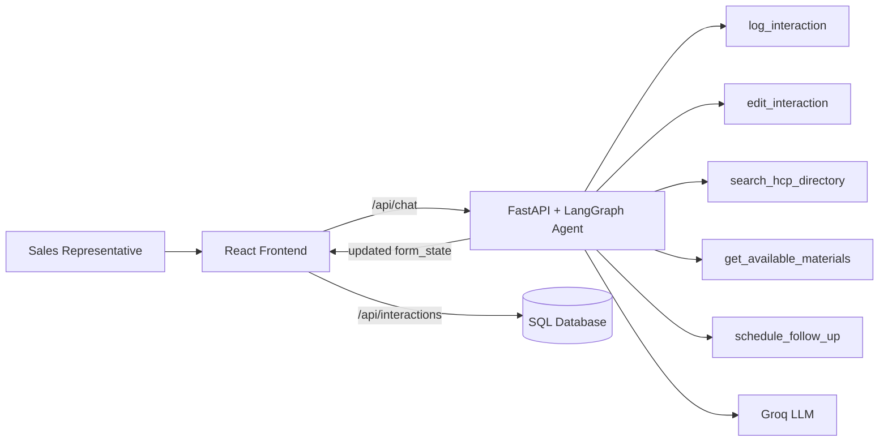
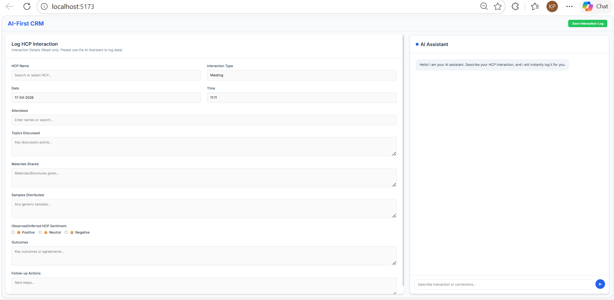

# AI-First CRM HCP Module

An AI-driven CRM experience built for Life Sciences field teams, where interaction logging is handled by conversation instead of manual form entry.

## Live Deployment

**Production URL:** https://ai-first-crm-hcp-module-production-c43c.up.railway.app

---

## Why This Project Is Different

Most CRM screens make reps fill long forms after meetings. This module flips that flow:

- Left side is a structured HCP interaction form.
- Right side is a LangGraph-based AI copilot.
- User speaks naturally; AI updates structured fields.
- Manual form typing is intentionally blocked to keep logging consistent.

This creates faster capture, fewer missed fields, and clean structured records for analytics.

## Core Product Idea

| Traditional CRM Pain | AI-First CRM Behavior |
|---|---|
| Manual field-by-field typing | Natural language interaction logging |
| Frequent spelling/date errors | AI-guided extraction + correction tools |
| Disconnected follow-up notes | Structured follow-up actions inside form state |
| Low post-meeting adoption | Conversational workflow reps actually use |

---

## System Architecture



## Tech Stack

| Layer | Technologies |
|---|---|
| Frontend | React, Redux Toolkit, Vite, Axios |
| Backend API | FastAPI, Pydantic, Uvicorn |
| Data Layer | SQLAlchemy, SQLite (default) |
| Agent Runtime | LangGraph, LangChain |
| Model Provider | Groq (`llama-3.3-70b-versatile`) |

---

## LangGraph Tools Implemented

1. `log_interaction`: Extracts structured HCP interaction fields from free text.
2. `edit_interaction`: Applies precise field-level corrections on user command.
3. `search_hcp_directory`: Resolves HCP names from internal mock directory data.
4. `get_available_materials`: Returns product-linked marketing/clinical material options.
5. `schedule_follow_up`: Adds future action items with timing to follow-up fields.

---

## API Surface

| Method | Endpoint | Purpose |
|---|---|---|
| POST | `/api/chat` | Conversational extraction and form updates |
| POST | `/api/interactions` | Persist current form state as a CRM interaction |
| GET | `/api/interactions` | List all saved interactions |

When frontend build files are present, FastAPI also serves the SPA from `/`.

---

## Local Setup

### Prerequisites

- Python 3.10+
- Node.js 18+
- Groq API key: https://console.groq.com/keys

### 1) Backend Setup

```powershell
cd backend

python -m venv venv
venv\Scripts\activate

pip install -r requirements.txt
```

Create `backend/.env` and add:

```env
GROQ_API_KEY=your_groq_api_key_here
```

Run backend:

```powershell
uvicorn main:app --reload
```

Backend should be available at `http://127.0.0.1:8000`.

### 2) Frontend Setup

```powershell
cd frontend
npm install
npm run dev
```

Open `http://localhost:5173`.

---

## Example User Prompts

- "Today I met Dr. John Smith. Sentiment was positive and we discussed dose adherence."
- "Change sentiment to neutral and update date to tomorrow."
- "Show available material for Product X and schedule follow-up next week."

---

## Project Structure

```text
AI-First CRM HCP Module/
|- backend/
|  |- agent.py
|  |- main.py
|  |- database.py
|  |- models.py
|  |- requirements.txt
|- frontend/
|  |- src/
|  |  |- components/
|  |  |- store/
|  |- package.json
|- image/
|  |- Dashboard.png
|  |- Form Error Correction.png
|  |- Initial Logging & Material Lookup.png
|  |- Scheduling a Follow-up.png
|  |- Specific Material Lookup.png
|- README.md
```

---

## Screenshots

### Initial Logging and Material Lookup


### Specific Material Lookup


### Form Error Correction


### Scheduling a Follow-up


### Dashboard


---

## Deployment Notes

- Frontend can be built with `npm run build` inside `frontend`.
- Backend serves built frontend assets automatically when `frontend/dist` exists.
- CORS is currently open (`*`) and should be restricted before strict production compliance.

---

## License

MIT

Built for AI-first CRM workflows in healthcare engagement systems.
